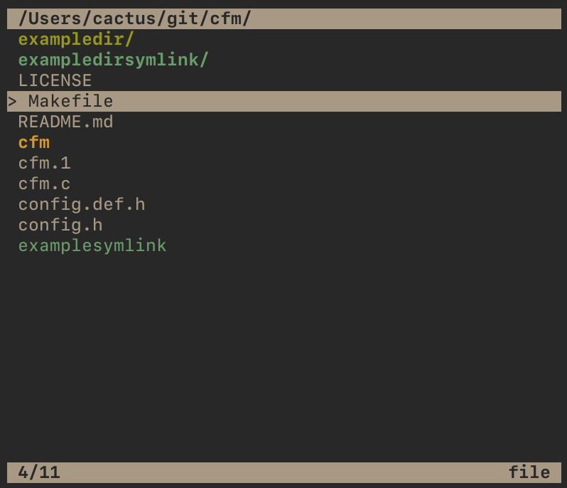

# Cactus File Manager

Cactus File Manager (cfm) is a TUI file manager with the goal of being simple,
easy, and bloat-free, utilizing Vi-inspired keybinds. Whether or not
you should use it depends on whether or not you like the name and/or the dev,
like with all software.

*Note: the screenshot above has a non-default pointer and no alternative
views enabled.*

[**Demo**](https://asciinema.org/a/297087) showing off deletion, undo, marks, and basic
navigation.

## Configuration

To configure cfm before building, you should copy `config.def.h` to `config.h`
and then modify it to suit your needs. Each option is explained within the file.
If you build cfm without creating a config, it will create a default one for
you.

There are some options which cfm will attempt to use environment variables for.
These are `$EDITOR`, `$SHELL`, and `$OPENER`. If you want to specify a specific
option just for cfm, it will first try to find these variables prefixed with
`$CFM_`. For example, if your `$EDITOR` is set to vim but you want to tell
cfm to use emacs, you could use `export CFM_EDITOR='emacs'`. If you installed
cfm via a package manager, or if you are using the default configuration, you
can specify these environment variables to configure cfm without rebuilding.
cfm uses a temporary directory for its deleted files (to enable undo and
cut/paste). If it's not set in `config.h`, then cfm will attempt to use the
`$CFM_TMP` environment variable. If this is not set either, then `/tmp/cfmtmp`
will be used. If a temporary directory is not specified in any way or it cannot
create the directory it is attempting to use, cfm will disable undo and
cut/paste.

## Building

`make`

## Installing

### From Source

Use `sudo make install`. You can specify a `PREFIX` or `DESTDIR` like with many
makefiles. By default, `PREFIX` is `/usr/local/`, but if you wish to install
into `/usr`, you can do `sudo make install PREFIX=/usr`.

### With a Package Manager

At the moment, cfm is available from the following sources:

- [KISS](https://github.com/kisslinux/community/tree/master/community/cfm) - Maintained by me (Will Eccles)
- [AUR](https://aur.archlinux.org/packages/cfm/) - Maintained by Hawkeye0021

## Bugs

At the moment, the main bug is that copying a directory into itself (i.e. doing
the sequence <kbd>yy</kbd><kbd>l</kbd><kbd>p</kbd> on a directory) will cause a
huge amount of recursion and you will end up with a huge file tree.

Workaround: Don't do that.

If you find a bug, please post an issue on GitHub.

## Usage

The functions of some keys may be dependent on values set in `config.h`.

| Key(s) | Function |
| ------ | -------- |
| <kbd>q</kbd>, <kbd>Esc</kbd> | Quit cfm |
| <kbd>h</kbd> | Go up a directory[1](#1) |
| <kbd>j</kbd> | Move down[1](#1) |
| <kbd>k</kbd> | Move up[1](#1) |
| <kbd>l</kbd> | Enter directory, or open file in `EDITOR`[1](#1) |
| <kbd>dd</kbd> | Delete currently selected file or directory (there is no confirmation, be careful) |
| <kbd>T</kbd> | Creates a new file, opening `EDITOR` to obtain a filename[2](#2) |
| <kbd>M</kbd> | Creates a new directory, opening `EDITOR` to obtain a directory name[2](#2) |
| <kbd>R</kbd> | Renames a file, opening `EDITOR` to edit the filename[2](#2) |
| <kbd>gg</kbd> | Move to top |
| <kbd>G</kbd> | Move to bottom |
| <kbd>m</kbd> | Mark for deletion |
| <kbd>D</kbd> | Delete marked files (does not touch unmarked files) |
| <kbd>u</kbd> | Undo the last deletion operation (if cfm was unable to access/create its trash directory `~/.cfmtrash`, deletion is permanent and this will not work) |
| <kbd>X</kbd> | Cut the current file or directory (to be pasted again with <kbd>p</kbd> |
| <kbd>yy</kbd> | Copy the current file or directory (to be pasted again with <kbd>p</kbd> |
| <kbd>p</kbd> | Paste the previously copied or cut file or directory |
| <kbd>e</kbd> | Open file or directory in `EDITOR` |
| <kbd>o</kbd> | Open file or directory in `OPENER` |
| <kbd>S</kbd> | Spawns a `SHELL` in the current directory |
| <kbd>r</kbd> | Reload directory |
| <kbd>.</kbd> | Toggle visibility of hidden files (dotfiles) |
| <kbd>Return</kbd> | Works like <kbd>o</kbd> if `ENTER_OPENS` was enabled at compile-time, else works like <kbd>l</kbd> |
| <kbd>Tab</kbd> | Switches to the next view |
| <kbd>\`</kbd> | Switches to the previous view |
| <kbd>1</kbd>...<kbd>0</kbd> | Switches to view N, up to the number specified by `VIEW_COUNT` (default 2) |

---

1 The arrow keys work the same as <kbd>H</kbd><kbd>J</kbd>K</kbd><kbd>L</kbd>.

2 The available characters for filenames are `A-Za-z
._-` by default, which is POSIX "fully portable filenames" plus spaces. If
you wish, you can disable spaces by setting `ALLOW_SPACES` to 0.
